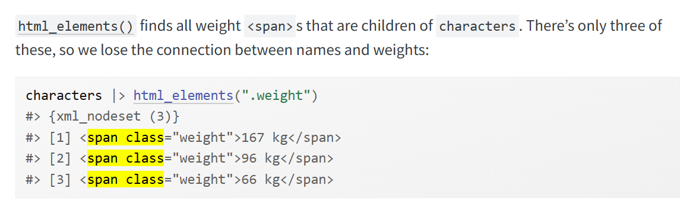
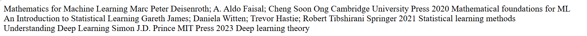

## Approach

I got my three books, which are open source. 

### Mathematics for Machine Learning

- Title
  - *Mathematics for Machine Learning*
- Authors
  - Marc Peter Deisenroth
  - A. Aldo Faisal
  - Cheng Soon Ong
- Publisher
  - Cambridge University Press
- Publication Year
  - 2020
- Focus
  - Mathematical foundations for machine learning

### An Introduction to Statistical Learning

- Title
  - *An Introduction to Statistical Learning*
- Authors
  - Gareth James
  - Daniela Witten
  - Trevor Hastie
  - Robert Tibshirani
- Publisher
  - Springer
- Publication Year
  - 2021
- Focus
  - Introductory statistical learning methods and core machine learning concepts

### Understanding Deep Learning

- Title
  - *Understanding Deep Learning*
- Authors
  - Simon J.D. Prince
- Publisher
  - MIT Press
- Publication Year
  - 2023
- Focus
  - Modern deep learning theory, architectures, and practice


### HTML

I got a reference of what an html looks like from [MDN](https://developer.mozilla.org/en-US/docs/Learn_web_development/Core/Structuring_content/Basic_HTML_syntax).
```{html}
<!doctype html>
<html lang="en-US">
  <head>
    <meta charset="utf-8" />
    <title>My test page</title>
  </head>
  <body>
    <p>This is my page</p>
  </body>
</html>
```


### JSON

I got a reference of what JSON looks like from [rfc-editor](https://www.rfc-editor.org/rfc/rfc8259).
```{json}
{
  "Image": {
      "Width":  800,
      "Height": 600,
      "Title":  "View from 15th Floor",
      "Thumbnail": {
          "Url":    "http://www.example.com/image/481989943",
          "Height": 125,
          "Width":  100
      },
      "Animated" : false,
      "IDs": [116, 943, 234, 38793]
    }
}
```

So, I'll just rewrite those into HTML/JSON, manually. We also need to figure out how to get it into a tibble. So, I could use rvest for HTML and jsonlite for JSON. 

```{r}
#| eval: false
#| include: true
library(tidyverse)
library(rvest)
library(jsonlite)

?read_html
?html_table
?fromJSON
?tibble
```

So I'll read the HTML and see if I need to expand upon it. Same thing with fromJSON. Ideally they should both be similar after conversion to a tibble.

## Codebase


```{r}
library(tidyverse)
library(rvest)
library(jsonlite)
```

I'll create the html.In the [reading](https://r4ds.hadley.nz/webscraping.html#html-basics) I see that there are examples where they use `html_elements()`to find the `<span class=x> value` I think I'll just do it like that, where I assign all the properties their own span class per book, then just grab them using `html_elements()`, where each class would be a column within a tibble. However, 

**r4ds 24.4.2**



### HTML

```{html}

<!doctype html>
<html lang="en">
<head>
<meta charset="utf-8">
<title>Machine Learning Books</title>
</head>

<body>

<div class="book">
  <span class="title">Mathematics for Machine Learning</span>
  <span class="authors">Marc Peter Deisenroth; A. Aldo Faisal; Cheng Soon Ong</span>
  <span class="publisher">Cambridge University Press</span>
  <span class="year">2020</span>
  <span class="focus">Mathematical foundations for ML</span>
</div>

<div class="book">
  <span class="title">An Introduction to Statistical Learning</span>
  <span class="authors">Gareth James; Daniela Witten; Trevor Hastie; Robert Tibshirani</span>
  <span class="publisher">Springer</span>
  <span class="year">2021</span>
  <span class="focus">Statistical learning methods</span>
</div>

<div class="book">
  <span class="title">Understanding Deep Learning</span>
  <span class="authors">Simon J.D. Prince</span>
  <span class="publisher">MIT Press</span>
  <span class="year">2023</span>
  <span class="focus">Deep learning theory</span>
</div>

</body>
</html>

```

```{r}
html <- '
<!doctype html>
<html lang="en">
<head>
<meta charset="utf-8">
<title>Machine Learning Books</title>
</head>

<body>

<div class="book">
  <span class="title">Mathematics for Machine Learning</span>
  <span class="authors">Marc Peter Deisenroth; A. Aldo Faisal; Cheng Soon Ong</span>
  <span class="publisher">Cambridge University Press</span>
  <span class="year">2020</span>
  <span class="focus">Mathematical foundations for ML</span>
</div>

<div class="book">
  <span class="title">An Introduction to Statistical Learning</span>
  <span class="authors">Gareth James; Daniela Witten; Trevor Hastie; Robert Tibshirani</span>
  <span class="publisher">Springer</span>
  <span class="year">2021</span>
  <span class="focus">Statistical learning methods</span>
</div>

<div class="book">
  <span class="title">Understanding Deep Learning</span>
  <span class="authors">Simon J.D. Prince</span>
  <span class="publisher">MIT Press</span>
  <span class="year">2023</span>
  <span class="focus">Deep learning theory</span>
</div>

</body>
</html>
'

writeLines(html, "books.html")
```

This is what it looks like in html: 

So now I'll the the JSON version. 

### JSON

```{json}
{
  "books": [
    {
      "title": "Mathmathics for Machine Learning",
      "authors": "Marc Peter Deisenroth; A. Aldo Faisal; Cheng Soon Ong",
      "publisher": "Cambridge University Press",
      "year":"2020",
      "focus":"Mathematical foundations for ML"
    },
    {
      "title": "An Introduction to Statistical Learning",
      "authors": "Gareth James; Daniela Witten; Trevor Hastie; Robert Tibshirani",
      "publisher": "Springer",
      "year":"2021",
      "focus":"Statistical learning methods"
    },
    {
      "title": "Understanding Deep Learning",
      "authors": "Simon J.D. Prince",
      "publisher": "MIT Press",
      "year": 2023,
      "focus": "Deep learning theory"
    }
  ]
}
```

```{r}
json <- '
{
  "books": [
    {
      "title": "Mathematics for Machine Learning",
      "authors": "Marc Peter Deisenroth; A. Aldo Faisal; Cheng Soon Ong",
      "publisher": "Cambridge University Press",
      "year": 2020,
      "focus": "Mathematical foundations for ML"
    },
    {
      "title": "An Introduction to Statistical Learning",
      "authors": "Gareth James; Daniela Witten; Trevor Hastie; Robert Tibshirani",
      "publisher": "Springer",
      "year": 2021,
      "focus": "Statistical learning methods"
    },
    {
      "title": "Understanding Deep Learning",
      "authors": "Simon J.D. Prince",
      "publisher": "MIT Press",
      "year": 2023,
      "focus": "Deep learning theory"
    }
  ]
}
'
write_lines(json, "books.json")
```

### Final

So now we have our html and json set up. Let's link it to the github versions

```{r}
json_url <- "https://raw.githubusercontent.com/Siganz/CUNY_Assignments/refs/heads/main/607/assignment_06/books.json"

html_url <- "https://raw.githubusercontent.com/Siganz/CUNY_Assignments/refs/heads/main/607/assignment_06/books.html"

```

```{r}
json_df <- fromJSON(json_url)$books |>
  tibble()
json_df

html_read <- read_html(html_url)
html_df <- tibble(
  title = html_read |> html_elements(".title") |> html_text(),
  authors = html_read |> html_elements(".authors") |> html_text(),
  publisher = html_read |> html_elements(".publisher") |> html_text(),
  year = html_read |> html_elements(".year") |> html_text() |> as.integer(),
  focus = html_read |> html_elements(".focus") |> html_text()
  )
html_df

```
Now we can do a truthiness check: 
```{r}
json_df == html_df

```
